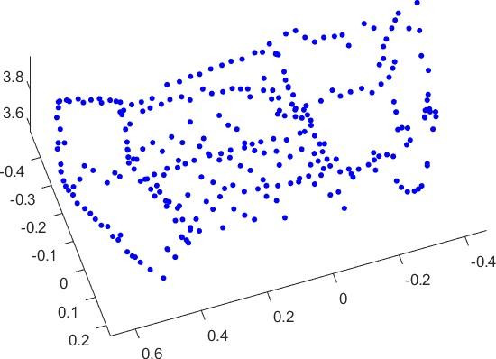
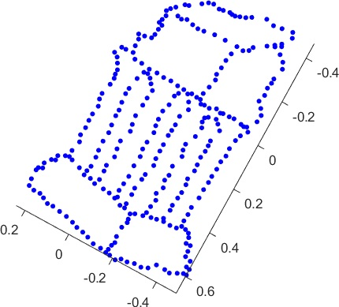
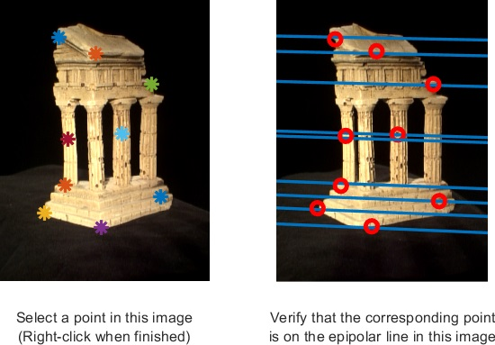
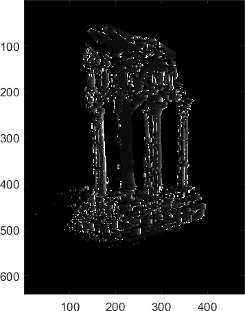
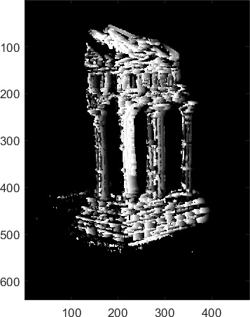
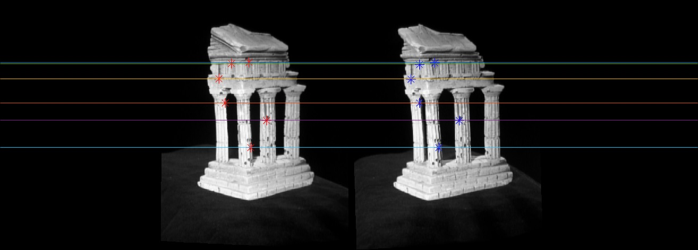

<!-- PROJECT LOGO -->
<div align="center">
  <a href="https://github.com/andreihar/3d-reconstruction">
    
  </a>
  
# 3D Reconstruction


<!-- PROJECT SHIELDS -->
[![Contributors][contributors-badge]][contributors]
[![Licence][licence-badge]][licence]
[![LinkedIn][linkedin-badge]][linkedin]

**Sparse and Dense 3D Reconstruction**

Techniques for reconstructing 3D scenes from multiple 2D images, including feature matching, triangulation, and depth estimation to create detailed 3D models.


</div>


---


<!-- TABLE OF CONTENTS -->
<details open>
  <summary>Table of Contents</summary>
  <ol>
    <li><a href="#about-the-project">About The Project</a></li>
    <li><a href="#built-with">Built With</a></li>
    <li><a href="#run">Run</a></li>
    <li>
      <a href="#functional-areas">Functional Areas</a>
      <ul>
        <li>
          <a href="#sparse-reconstruction">Sparse Reconstruction</a>
          <ul>
            <li><a href="#epipolar-correspondence">Epipolar Correspondence</a></li>
          </ul>
        </li>
        <li>
          <a href="#dense-reconstruction">Dense Reconstruction</a>
          <ul>
            <li><a href="#image-rectification">Image Rectification</a></li>
          </ul>
        </li>
        <li><a href="#pose-estimation">Pose Estimation</a></li>
      </ul>
    </li>
    <li><a href="#contributors">Contributors</a></li>
    <li><a href="#licence">Licence</a></li>
  </ol>
</details>


<!-- ABOUT THE PROJECT -->
## About The Project

3D Reconstruction is a project developed for the course in Computer Vision in the Spring semester of 2023. The primary focus of the project is on 3D reconstruction from 2D images, a challenging problem that involves recovering the depth and structure of a scene from multiple viewpoints. The project integrates key computer vision techniques such as Sparse and Dense Reconstruction, Epipolar Geometry, Image Rectification, and Pose Estimation to achieve this goal.

The objective was to implement and understand the core algorithms that drive these processes, including the Eight-Point Algorithm, triangulation, and stereo matching. By applying these techniques, the project demonstrates how to accurately reconstruct a 3D model from a set of 2D images, showcasing the interplay between mathematical concepts and practical implementation. The project also explores the challenges of handling real-world image data, such as dealing with noise and ensuring precise camera calibration.

This project highlights the importance of foundational computer vision principles in 3D reconstruction and provides a comprehensive understanding of the steps involved in transforming 2D images into a coherent 3D model. The techniques implemented here have wide-ranging applications, from augmented reality to robotics, offering valuable insights into the practical challenges and solutions in computational photography.

### Built With

* [![MATLAB][matlab-badge]][matlab]


<!-- RUN -->
## Run

All relevant code is located in the `matlab` folder. All scripts are prefixed with `test`.

```matlab
testTempleCoords	%% Sparse Reconstruction
testRectify			% Image Rectification
testDepth			%% Dense Reconstruction
testPose			%% Pose Estimation
testKRt				%% Pose Estimation
```


<!-- FUNCTIONAL AREAS -->
## Functional Areas

### Sparse Reconstruction

Sparse Reconstruction aims to recover a 3D representation of a scene from a set of 2D images by identifying and matching key features across the images. The process begins with the Eight-Point Algorithm, which computes the Fundamental Matrix based on corresponding points between two images. This matrix captures the geometric relationship between the views, setting the stage for Epipolar Correspondence, which constrains the search for matching points along specific lines in each image. This step ensures that the matched points are geometrically consistent, enhancing the accuracy of the reconstruction. Following this, the Essential Matrix is derived by incorporating the intrinsic parameters of the cameras, refining the relationship between the two views.

With the Essential Matrix in hand, the next step involves estimating the relative pose, which includes the rotation and translation between the two camera positions. Using this information, triangulation is performed to reconstruct the 3D positions of the matched points by identifying the spatial points that correspond to the 2D projections in both images. Together, these steps enable the accurate reconstruction of sparse 3D points from the input images. This sparse 3D point cloud serves as the foundation for further processing, such as dense reconstruction, which aims to create a more complete and detailed 3D model of the scene.

<p align="center">


</p>

#### Epipolar Correspondence

Epipolar Correspondence is a crucial part of Sparse Reconstruction, as it deals with the problem of finding corresponding points between two images. The project implements this by leveraging the Fundamental Matrix to compute the epipolar lines, which are the key to reducing the search space for matching points. Instead of searching the entire image, the correspondence is constrained to the epipolar line, which drastically simplifies the problem. The matching process is further refined by using a similarity measure, which compares pixel intensities along the epipolar line to identify the best match. This method ensures that the corresponding points found are consistent with the epipolar geometry, thereby improving the accuracy of the subsequent 3D reconstruction steps.

<p align="center">

</p>

### Dense Reconstruction

Dense Reconstruction builds upon the sparse set of 3D points generated during Sparse Reconstruction to create a more detailed 3D model of the scene. This process involves estimating depth and disparity maps, which provide a dense representation of the distance between the cameras and every point in the scene. The project implements this by first rectifying the images, aligning them so that corresponding points lie on the same row in both images. Once the images are rectified, the disparity map is computed by finding the difference in horizontal position for corresponding points. This disparity map is then converted into a depth map, which represents the distance of each point from the camera. The depth map is used to generate a dense 3D point cloud, providing a much more complete and detailed representation of the scene compared to the sparse reconstruction.

<p align="center">


</p>

#### Image Rectification

Image Rectification is a crucial preprocessing step in Dense Reconstruction, transforming images so that the epipolar lines become horizontal, which simplifies finding corresponding points between them. In this project, rectification is achieved by computing transforms based on the Essential or Fundamental Matrix, which aligns the images horizontally. The images are then warped according to these transforms, correcting any perspective distortions and ensuring that corresponding points lie on the same row. This process significantly reduces the complexity of stereo matching, laying the groundwork for accurate disparity estimation and a more precise 3D reconstruction.

<p align="center">

</p>

### Pose Estimation

Pose Estimation refers to determining the position and orientation of the camera relative to the scene. This is critical for aligning the 3D model generated from the reconstruction process with the real-world coordinates. The project implements Pose Estimation by first computing the Camera Matrix, which combines both the intrinsic parameters (like focal length and principal point) and the extrinsic parameters (rotation and translation). The intrinsic parameters describe the internal characteristics of the camera, while the extrinsic parameters describe its position and orientation relative to the scene. By accurately estimating these parameters, the project ensures that the 3D reconstruction is correctly aligned with the physical scene, enabling accurate measurements and further processing.


<!-- CONTRIBUTION -->
## Contributors

- Andrei Harbachov ([Github][andrei-github] · [LinkedIn][andrei-linkedin])


<!-- LICENCE -->
## Licence

Because 3D Reconstruction is MIT-licensed, any developer can essentially do whatever they want with it as long as they include the original copyright and licence notice in any copies of the source code.


<!-- MARKDOWN LINKS -->
<!-- Badges and their links -->
[contributors-badge]: https://img.shields.io/badge/Contributors-1-44cc11?style=for-the-badge
[contributors]: #contributors
[licence-badge]: https://img.shields.io/github/license/andreihar/3d-reconstruction.svg?color=000000&style=for-the-badge
[licence]: LICENSE
[linkedin-badge]: https://img.shields.io/badge/LinkedIn-0077B5?style=for-the-badge&logo=linkedin&logoColor=white
[linkedin]: https://www.linkedin.com/in/andreihar/
[matlab-badge]: https://img.shields.io/badge/matlab-08609d?style=for-the-badge&logo=zalando&logoColor=ffffff
[matlab]: https://www.mathworks.com/products/matlab.html/

<!-- Technical links -->
[efros]: http://graphics.cs.cmu.edu/people/efros/research/quilting/quilting.pdf

<!-- Socials -->
[andrei-linkedin]: https://www.linkedin.com/in/andreihar/
[andrei-github]: https://github.com/andreihar